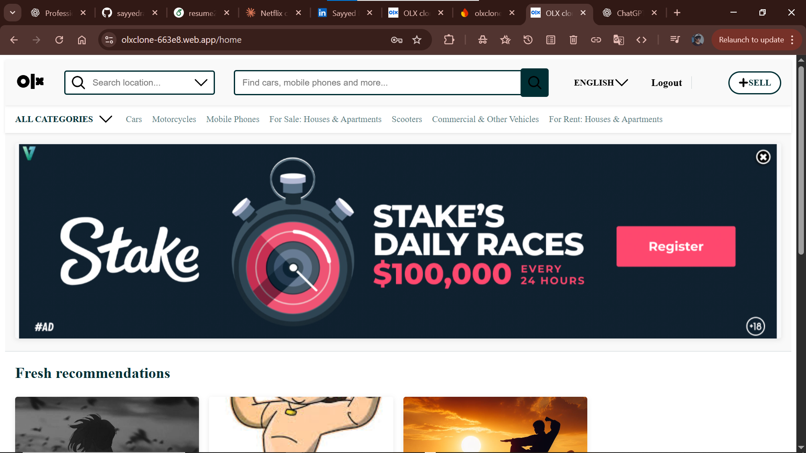
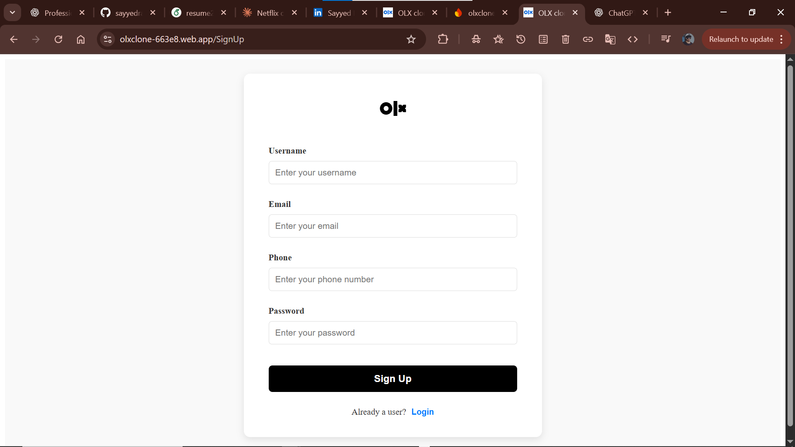

 
#  OLX Clone – Full Stack Web Application

A modern OLX-inspired marketplace web app built with **React (Vite)** and **Firebase**, allowing users to buy and sell products with secure authentication and real-time data updates.

 **Live Demo:**  
👉 [https://olxclone-663e8.web.app/](https://olxclone-663e8.web.app/)

---

##  Features

- 🔐 User Authentication (Sign up / Login / Logout)
- 🛍️ Add, view, and browse product listings
- 📦 Real-time database using Firebase Firestore
- 🔄 Live updates without page refresh
- 🔒 Secure Firestore rules for authenticated users
- ⚡ Fast performance with Vite

---

##  Tech Stack

**Frontend**
- React.js (Vite)
- JavaScript (ES6+)
- HTML5, CSS3, Tailwind CSS

**Backend / Services**
- Firebase Authentication
- Firebase Firestore

**Tools & Deployment**
- Firebase Hosting
- Git & GitHub
- VS Code

---

##  Screenshots

> Add screenshots in `screenshots/` folder for better impact.

```md


 ````

---

##  Installation & Setup

1. Clone the repository:

```bash
git clone https://github.com/sayyedrabeeh/OLX_clone.git
```

2. Navigate into the project folder:

```bash
cd OLX_clone/olxclone
```

3. Install dependencies:

```bash
npm install
```

4. Run the app locally:

```bash
npm run dev
```

---

 

---

##  Deployment

Deploy the app using **Firebase Hosting**:

```bash
npm run build
firebase deploy
```

---
 
 
**Sayyed Rabeeh**
🔗 GitHub: [https://github.com/sayyedrabeeh](https://github.com/sayyedrabeeh)
🔗 LinkedIn: [https://www.linkedin.com/in/sayyed-rabeeh/](https://www.linkedin.com/in/sayyed-rabeeh/)

---

⭐ If you like this project, consider giving it a star!

```

 
 